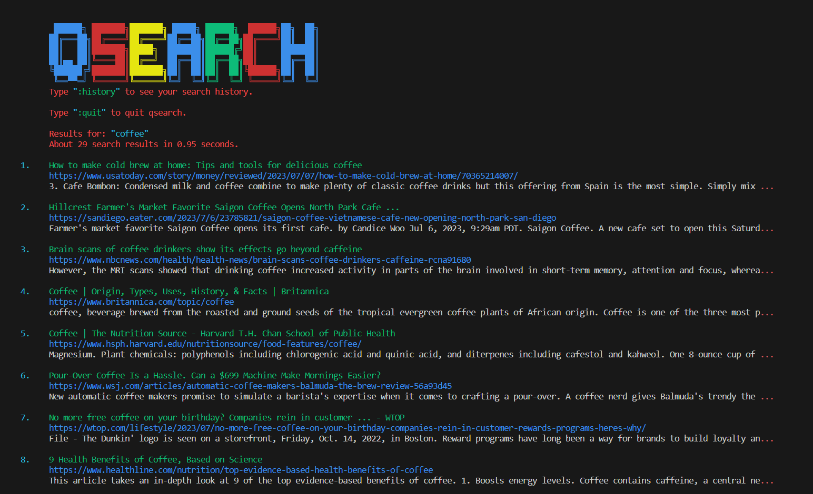
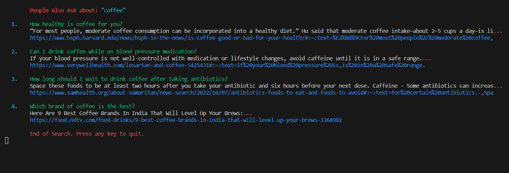

# Presidio Coding Challenge
## Problem statement
* **Develop a program that accepts a topic as a string input from the user, searches the internet for information about it, and answers any questions regarding the topic.**
* Try to use your imagination to make the program more interesting and useful. 
* Feel free to use the languages and technologies with which you feel most comfortable. 
* Incorporate the standards and best practices you are familiar with. 
* Document the code (add comments as appropriate) 
* Provide instructions to run the code. 

## Solution
* A terminal that takes user input as the topic to search the Internet and returns most relavant titles, urls and short intros, then creates a list of "people also ask" questions with answers to show in the terminal, you can click the url to see related webpages.
* I used DuckDuckGo for gathering info as it is a privacy-focused search engine that doesn’t save search history or track your online activities. It will be a neutual platform to gather information on Google, Bing and Yahoo without commercials or personal recommandation features.
* Google SerpApi is introduced to generate related questions regarding the topic. (Sometimes this API is slow so it might take a while to generate related questions)
* Both of them have packages in Python and simple to set up which is why I chose it in this program.
* Added ```:history``` function to browse search history.
* Added ```:quit``` function to quit program.
* After the code implementation, I used pylint library to check code quality and see if it's following the Python's best practices.

## Enviroment 
* Python3.8

## Install dependencies
```
    virtualenv -p python venv
    source venv/bin/activate
    pip3 install -r requirements.txt
```
* Get an API key from https://serpapi.com/ and change the value of ```API_KEY``` in config file


## File structure
* venv/ = virtual enviroment
* src/main.py = Quick Search main module
* src/Logo.py = search logo module
* src/images = screenshots of the program
* config.yml = config info
* requirements.txt = required packages to run the program
* run.sh = bash script to start the progrm


## How to use class
```
    # initialize class with a query_search string
    quick_search=QuickSearchService(query_search)

    # print all avalible search results
    quick_search.search_info()
    
    
    # get related questions and answers from Google
    quick_search.get_related_questions()

```

## How to start simple cli
```
    chmod +x run.sh
    ./run.sh
```

## Python cli
```
    python3 src/main.py
```


## How long this took me
* around 6 hrs

## Examples
Quick Search Terminal with topic "coffee"<br />
<br />


Related questions and answers<br />
<br />


History Page Terminal<br />
<br />


